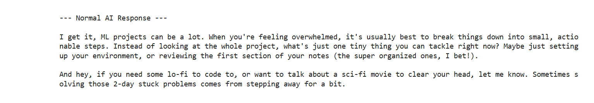
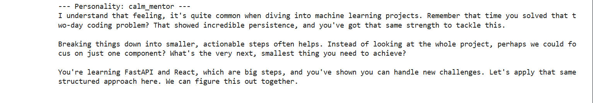
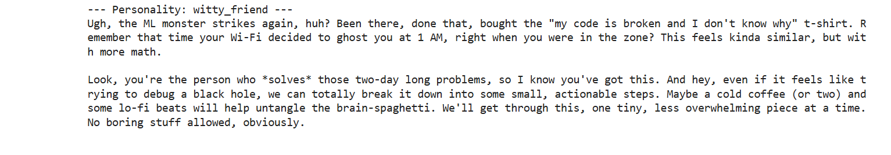
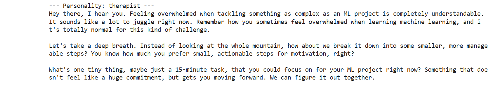

# AI Companion

An **AI-powered personal companion** that remembers your preferences, emotional patterns, and long-term facts to respond in multiple personalities.  
Built with **Google Gemini-2.5-Flash** and a custom memory engine.  

Interact with your AI companion in four styles:  
1. **Normal/Neutral** – straight response using memory  
2. **Calm Mentor** – patient, guiding, encouraging  
3. **Witty Friend** – casual, humorous, relatable  
4. **Therapist** – empathetic and supportive  

**Example User Message Used in All Demonstrations:**  
> "I'm feeling overwhelmed with my ML project."

---

## Features

- **Memory Extraction:** Extracts user **preferences**, **emotional patterns**, and **long-term facts** from conversation. This allows the AI to personalize responses based on the user’s habits, likes/dislikes, and recurring emotional triggers.  
- **Entity-based Memory:** Memory is stored as structured entities (preference, emotion, fact). This makes the system **scalable**, queryable, and ready for vector databases in future upgrades.  
- **Personality Responses:** The AI can respond in different personalities or a neutral style while leveraging memory for contextually relevant replies.  
- **Conversation Storage:** Original messages and extracted memory are stored for traceability and consistent user experience.  
- **Visual Showcase:** Screenshots demonstrate how the AI responds differently based on personality style for the same user input.

---

## Technical Justification

1. **Why structured memory?**  
   - Using entities ensures that the AI remembers **meaningful, reusable information** rather than unstructured blobs.  
   - It allows targeted recall: e.g., if the user dislikes boring tasks, every personality can tailor advice to avoid suggesting boring activities.  
   - Entities can be easily indexed, stored in **JSON** now, or upgraded to a **vector database** for semantic search in future iterations.

2. **Why multiple personalities?**  
   - Different personalities allow **emotional alignment** with the user’s current mood.  
   - Provides **testing of AI persona flexibility** and showcases ability to use memory context consistently across styles.

3. **Why JSON-based memory now?**  
   - Simple and transparent for evaluation and debugging.  
   - Scalable path to vector databases ensures this design is forward-compatible.

---

## Showcase

**User input:**  
> "I'm feeling overwhelmed with my ML project."

### Normal Response


### Calm Mentor


### Witty Friend


### Therapist


---

## File Structure
```
Companion_AI/
├─ main.ipynb # Main notebook showcasing memory extraction and responses for all personalities
├─ personality.py # Helper functions for defining personalities; easy to add new personalities
├─ Conversation_Data/
│ └─ conv.json # Original user messages (~30 messages) used for memory extraction
├─ Memory/
│ ├─ extractor.py # Extracts structured entities: preferences, emotional patterns, long-term facts
│ ├─ schemas.py # Pydantic schemas for validation of extracted memory
│ ├─ store.py # Defines memory storage; currently JSON, scalable to vector DB
│ └─ memory_store.json # Stores extracted memory entities in structured JSON format
├─ SS/ # Screenshots of AI responses for different personalities
└─ README.md # This file
```
